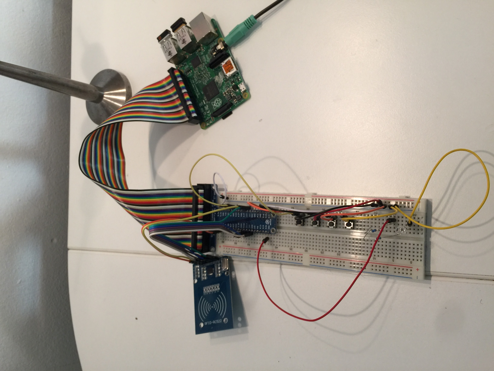

# augustJB

## changelog
### 2016-09-26 
first alpha (0.01) version
- RFID basic functionality :D

## TODO

### Startup
- Clean GPIO 
- set GPIO no warning
- Database
	- load DB
	- update (look for new books)
	- if no book in DB => *STOP*
	- load active book
		=> if no active book, set first book to active
	- load player
	- init LED
	- load last know position, aka *progress*
	- start loop 
	- wait for RFID :)

### Final Hardware
- Check port numbering (model a/b vs 2nd generation)
- power saving
- minimum ISO
- autostart *augustJB* after power on
- **BACKUP FINAL SD CARD -> IMAGE**

## MISC

### Music
- stored in 